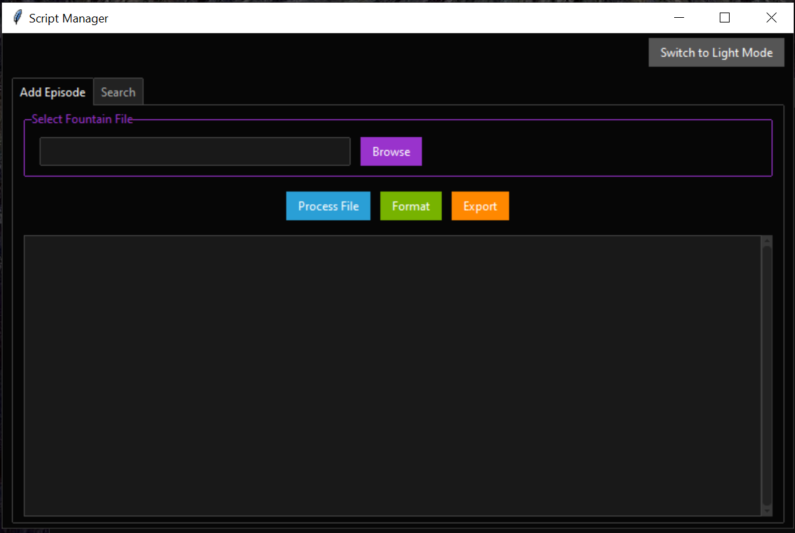

# SCREENPLAY - Fountain Script Data Manager


## Overview

This project offers a tool for managing Fountain screenplay script data with both command-line and GUI options. It enables you to:
- Add episodes from Fountain script files to a JSON database
- Look up details about artists and locations across your scripts
- Use a user-friendly GUI with theme support to interact with the tool
- Format and export screenplay data into Markdown files
- Save search results in both text and Markdown formats

## Features

### Command-line Mode
- Process Fountain screenplay files and extract:
  - Synopsis  
  - Scene details (setting, location, time of day)
  - Artist information (artist name, costume, props)
- Store parsed data in a JSON file
- Search for artists or locations across multiple episodes
- Save search results in text and Markdown files
- Format and export screenplay data into a `.md` file
- Prevent duplicate episode processing

### GUI Mode (Now with Themed Interface)
- Perform all actions available in the command-line version through a graphical interface
- Easy access for non-technical users
- Dark and Light theme support (Switch between Cyborg and Yeti themes)
- Compiled GUI version available for direct use (in `dist/` directory) 

  

**Note :** newest version are not pre-compiled, you need to manually compiled it.

## Requirements

### Command-line Version
- Python 3.7+
- Standard library modules: `re`, `json`, `os`, `sys`, `argparse`

### GUI Version
- Python 3.7+
- `tkinter` (included with most Python distributions)
- `ttkbootstrap` (for themed GUI experience)
- **Compiled version**: No additional dependencies needed (available in the `dist/` directory)

## Installation

### Command-line Version
1. Clone the repository:
    ```bash
    git clone https://github.com/EiadurRahman/screenplay.git
    cd screenplay
    ```
2. Ensure you have Python installed:
    ```bash
    python --version
    ```

### GUI Version
1. Install dependencies (only for running the Python GUI version):
    ```bash
    pip install ttkbootstrap
    ```
2. Run the GUI:
    ```bash
    python gui_version.py # Now with themes!
    ```
3. **Using the Compiled GUI**:
    - Locate the executable in the `dist/` directory:
      - Windows: `dist/ScriptManager_version.exe`
    - Run the executable directly (no Python required).

## Usage

### Command-line Version
#### Adding an Episode
```bash
python main.py addEpisode path/to/screenplay.fountain
```

#### Searching for Artists
```bash
python main.py lookup --artist "John Doe"
```

#### Searching for Locations
```bash
python main.py lookup --location "Downtown"
```

### GUI Version
- Open the application.
- Click `Add Episode` to process a new screenplay.
- Use the `Search` tab to look for Artists or Locations.
- Switch themes using the `Switch to Light/Dark Mode` button.

## Fountain Script Format Requirements

### Synopsis
```
= this is a synopsis
```

### Scene Headings
```
EXT. or INT. or EXT/INT. Location - Time of Day #SceneNumber#
```

### Artist/Costume/Props
```
[Artist Name, Costume Description, Props]
```

## Output

- Parsed data is saved in `data.json`
- Search results display Synopsis, scene number, setting, location, and artist details
- Themed GUI enhances readability and user experience

## Contact

md. Eiadur Rahman - eiadurrahman07@gmail.com

Project Link: [https://github.com/EiadurRahman/screenplay](https://github.com/EiadurRahman/screenplay)
